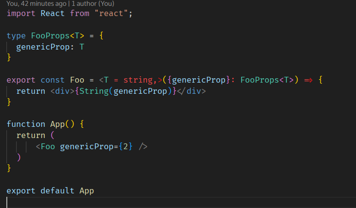
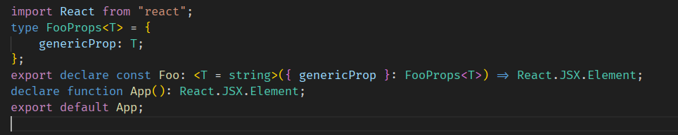
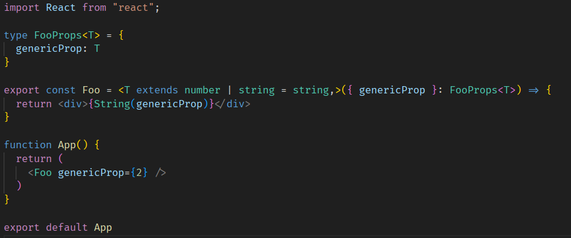

# VSCode JSX Syntax Bug

In `src/index.tsx`, the `Foo` component is a generic component with a type default.

If you remove the fallback, or add an `extends`, the error highlighting goes away.

If you run `pnpm build`, the generated type declaration is rendered perfectly fine.

## Screenshots
The following screenshots were taken of my editor using the `Dark Modern` built-in VSCode theme,
all extensions disabled, and Semantic Highlighting enabled. The bug, however, isn't exclusive to
Semantic Highlighting.

Unmodified `src/index.tsx`

The generated `types/index.d.ts`

`src/index.tsx` after adding an `extends` to the generic

